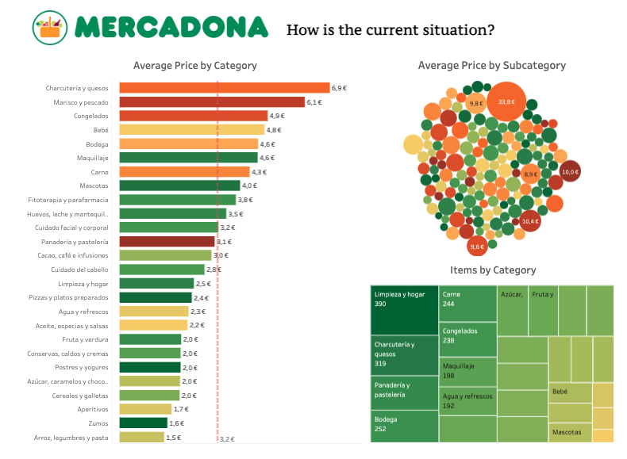
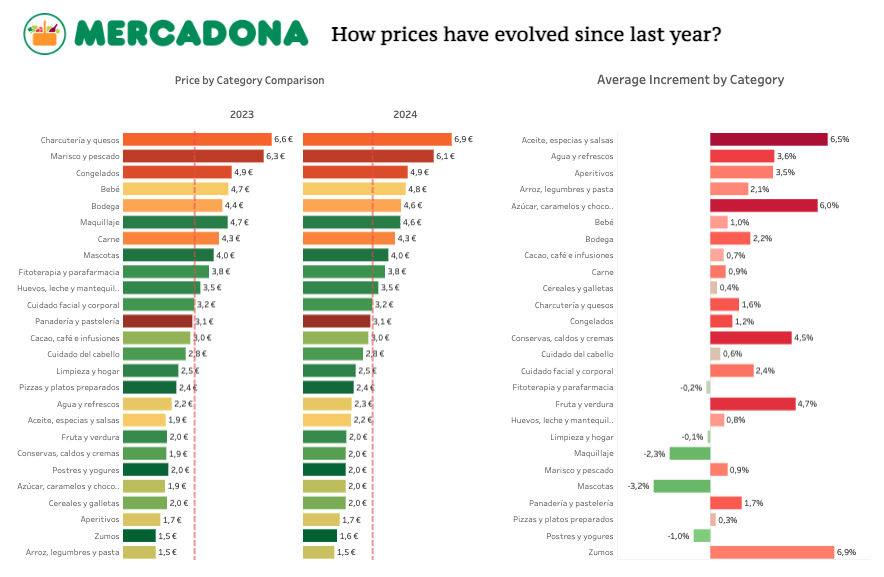
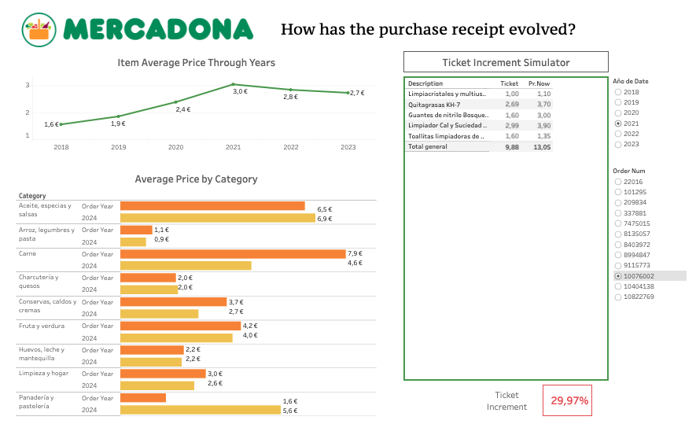
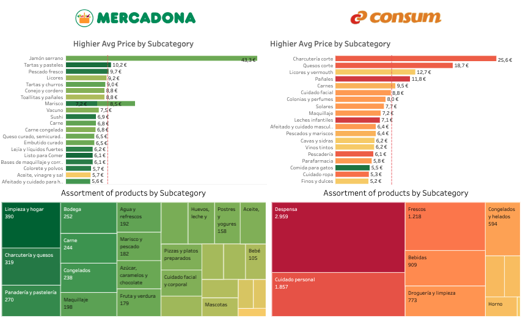

# Exploring Evolution in Grocery Prices

## Project Summary:
This project, completed as the final assignment for my Ironhack Data Analytics Bootcamp, was awarded the Best Data Analytics Project in my cohort. Developed within 9 days, it compares grocery price evolution and trends between two supermarkets using web scraping, data transformation, and Tableau visualization.

## Objectives

- Understand the current situation based on a reference supermarket.
- Analyze how prices have evolved based on a reference supermarket.
- Compare prices across different supermarkets.

## Workflow

1. **Extract** - Python
2. **Transform** - Python
3. **Load** - MySQL
4. **Visualize** - Tableau

## Collecting Data

To gain a comprehensive understanding of grocery price evolution, we collected data from various sources. This involved web scraping, utilizing public databases, and processing historical purchase orders. Each step required specific tools and techniques to ensure the data's accuracy and relevance.

### 1. Mercadona WebScraping
- **Tool:** Selenium (Python)
- **Challenges:** Request limits exceeded
- **Solution:** Set a waiting time for every 100 requests
- **Result:** Mercadona 2024 DB
  - **Relevant Data:** Products, prices, categories

### 2. Public Database
- **Data:** Historical data from 2023
- **Result:** Mercadona 2023 DB
  - **Relevant Data:** Products, prices, categories

### 3. Historical Purchase Orders
- **Data:** Purchase tickets (PDF) 
- **Relevant Data:** Products, prices, date of purchase

## Transforming Data

In this phase, we processed the raw data collected from various sources to create structured and consistent datasets. We organized the product and price information from Mercadona databases and purchase orders. Key steps included handling missing product codes and utilizing FuzzyWuzzy for matching product names that had evolved over time.

### From Mercadona DB 2024:
- **Product Table**
    - Columns: Product Code, Description, Category, Subcategory
- **2024 Price Table:**
    - Columns: Product Code, Price 2024, Collected Date

### From Mercadona DB 2023:
- **2023 Price Table:**
    -  Columns: Product Code, Price 2023, Collected Date

### From Historical Purchase Orders:
- **Purchase Orders Table:**
    - Columns: Product Code, Order Num, Price, Units, Unit Price, Date of Purchase

    **Challenges:**
        - Automate transformation from PDF table to data.
        - Product codes missing from purchase tickets, and product names have evolved over time.
    **Solution:**
        - Created a script using Tabula and Tika libraries for data extraction.
        - Used FuzzyWuzzy for matching non-exact product names.

## Loading Data to SQL

Once the data was transformed, we loaded it into a SQL database. This involved creating interconnected tables for orders, products, and prices, all linked by the Product Code. This setup facilitated efficient querying and data retrieval for further analysis and visualization in Tableau.

- **Resulting Tables:**
  - Orders Table: Product Code, Order Num, Price, Units, Unit Price, Date of Purchase
  - Product Table: Product Code, Description, Category, Subcategory
  - 2023 Price Table: Product Code, Price 2023, Collected Date
  - 2024 Price Table: Product Code, Price 2024, Collected Date

- **Database:** All columns connected by the Product Code

## Insights from Mercadona Data:

The final step involved analyzing the transformed data to uncover key insights about Mercadona's sales performance, pricing trends, and customer purchasing behaviors. Using Tableau, we created comprehensive visualizations that illustrate these findings, allowing us to identify significant growth areas, customer satisfaction levels, and potential opportunities for cost reduction. This data-driven approach provides a clear understanding of Mercadona's market position and strategic directions.

For detailed visualizations and insights, refer to the Tableau story [here](https://public.tableau.com/app/profile/monica.delgado3686/viz/supermarket-story-final-project/Story1).

### How is the current situation? 

### How prices have evolve since last year? 

### How has the purchase receipt evolve? 

### Key Findings:

- Deli products, such as Meat, Cured meats and Fish, stand out as categories with higher prices ( all part of the protein group). Highlighting Serrano ham as the most expensive product.
- Since 2023, average prices have increased in almost all categories. High increases are seen in Oil and sugar-containing products, and notable increase in Fruits and Vegetables. Juices (sugar and fruit-based) also show a significant rise. 
- Compared to previous years, the average price has increased overall. In 2021, there was a considerable peak, followed by a slight decrease in 2022 and 2023.

## Comparing Supermarkets:

To gain more insights, I wanted to compare the current situation of Mercadona with another supermarket, Consum, which shares similar characteristics.

### Extracting Data

#### Consum WebScraping
- **Tool:** Selenium (Python)
- **Challenges:** Different website structure and data layout
- **Solution:** Developed a custom scraping script tailored to the new website, requiring thorough understanding of its structure and functionality
- **Result:** Consum 2024 DB
  - **Relevant Data:** Products, prices, categories

### Transforming Data

Similar to Mercadona, the data from Consum underwent transformation to match the existing format used for Mercadona 2024 DB. This included standardizing product names, handling missing data points, and ensuring consistency across datasets.

### Loading Data to Tableau

Unlike Mercadona, where we loaded data into MySQL, for Consum, we directly imported the transformed data into Tableau for visualization and analysis.

## Insights from Comparison Data

By comparing Mercadona and Consum data, we aimed to identify similarities and differences in pricing strategies, and market positions. The Tableau visualization provides a detailed comparative analysis, highlighting key insights that can inform strategic decisions for both supermarkets.

For detailed visualizations and insights, refer to the Tableau story [here](https://public.tableau.com/app/profile/monica.delgado3686/viz/supermarket-story-final-project/Consum_vs_Mercadona).

### Supermarket Comparison Dashboard

### Key Findings:

It can be challenging to compare prices across supermarkets due to different product categorizations. Looking at more specific groups, we see that Mercadona has lower prices in Meat, while Consum has lower prices in Fish.